# 5 — Views Reference

Every screen in the app, field by field, with the conditions that show or hide each element.

> **Two things control what you see:**
> - **Your role** — Driver, or Dispatcher/Administrator.
> - **Your team's assignment mode** — Centralized or Decentralized.
>
> Where an element only appears for some users, it's flagged like this:
> *(dispatcher only)*, *(decentralized drivers only)*, etc.

Navigation is back-button based: detail screens have a **‹ Back** link in the top-left. There is no
bottom tab bar — you move between areas using the links in the Jobs screen header.

> 📸 **About the screenshots.** These are captured from a **dispatcher** account on a test site, so
> names, references, and addresses are sample data. Your screens show your own jobs and customers.
> Driver-only views (e.g. the Available / My Jobs tabs) are described in text where a dispatcher
> account can't display them.

---

## Setup & sign-in screens

### Connect your site
First-launch screen. Fields: **Site URL**, **Client ID**, **Client Secret** (hidden), and a
**Continue** button. Errors show in red above the button. Covered in
[04 — Connecting](04-connecting.md).

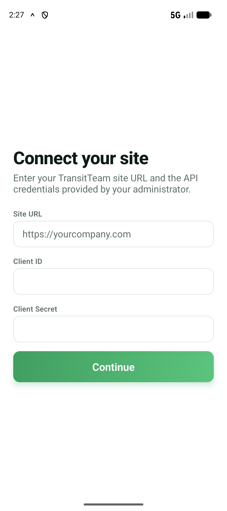

### Sign in
Shows the site you're connecting to in a banner, then **Username** and **Password** fields, a
**Sign in** button, and a **Change site** link to go back to Connect.

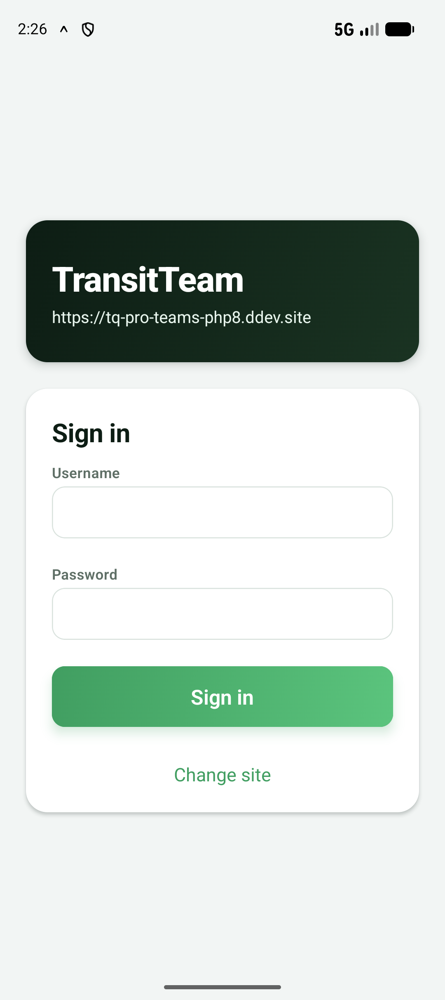

---

## Jobs list — the home screen

This is where you land after signing in. What it shows depends on who you are.

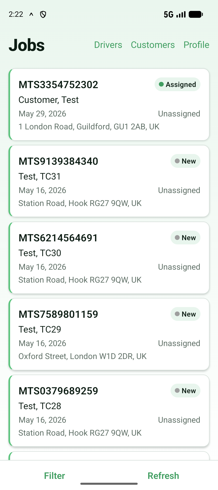

### Header
- **Title:** "Jobs".
- **Sync indicator** (next to the title) — appears only when something's happening:
  a spinner while syncing, a "**N pending**" badge for unsent changes, or a tappable
  "**N failed**" badge. See [06 — Sync & Offline](06-sync-and-offline.md).
- **Header links** (top-right):
  - **Drivers** *(dispatcher only)* → the Drivers list.
  - **Customers** *(dispatcher only)* → the Customers list.
  - **Profile** → your Profile/Settings.

### Offline banner
A coloured strip appears at the very top **when you're offline**: *"Offline — showing data from
X ago."* It disappears automatically when you're back online.

### Tabs *(decentralized drivers only)*
Decentralized drivers see two tabs:
- **Available** — jobs with no driver yet, that you can claim.
- **My Jobs** — jobs assigned to you.

Centralized drivers and dispatchers see a single list (no tabs).

### The list
Each job is a **Job Card** showing:
- **Job reference** (e.g. the job number/ref).
- **Status badge** (colour-coded — e.g. new, in progress, delivered).
- **Customer name** (surname first), when available.
- **Pickup time** — the scheduled pickup, or **ASAP** for as-soon-as-possible jobs.
- **Driver name** *(dispatcher only)* — or "Unassigned".
- **Pickup address** (first line), when available.
- **Sync state**, if the job has an unsent change: "↻ Pending sync" or "⚠ Update failed".

Tap a card to open the **Job detail**.
**Pull down** on the list to refresh.

### Toolbar (bottom)
- **Filter** — opens the filter sheet. A number badge shows how many filters are active.
- **Refresh** — manually syncs with the server.

### Empty states
If there are no jobs you'll see a friendly message — "No available jobs", "No jobs assigned to
you", "No jobs yet", or (with filters on) "No jobs match your filters."

---

### Filter sheet
Opened with the **Filter** button. Slides up from the bottom.

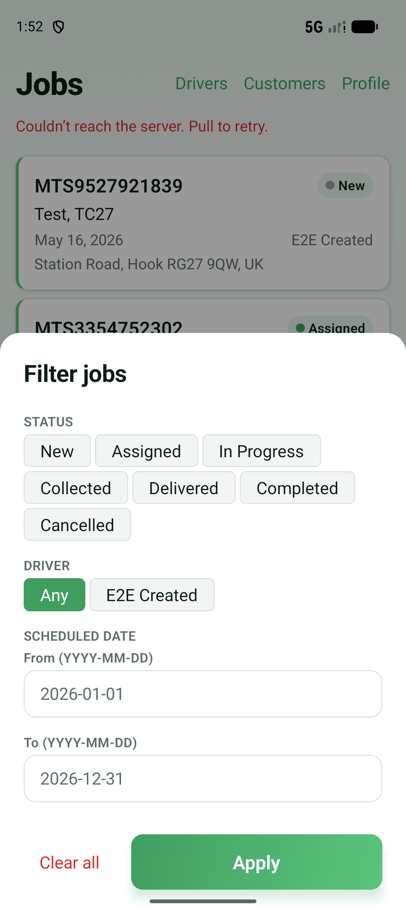

- **Status** — tap chips to include one or more statuses (multi-select).
- **Driver** *(dispatcher only)* — **Any**, or a single driver.
- **Scheduled date** — **From** and **To** boxes in `YYYY-MM-DD` format.
- **Clear all** — removes every filter.
- **Apply** — applies your selection and closes the sheet.

Filters only take effect when you tap **Apply**.

---

## Job detail

Opened by tapping a job card. Scrollable. Sections appear only when the job has that data.

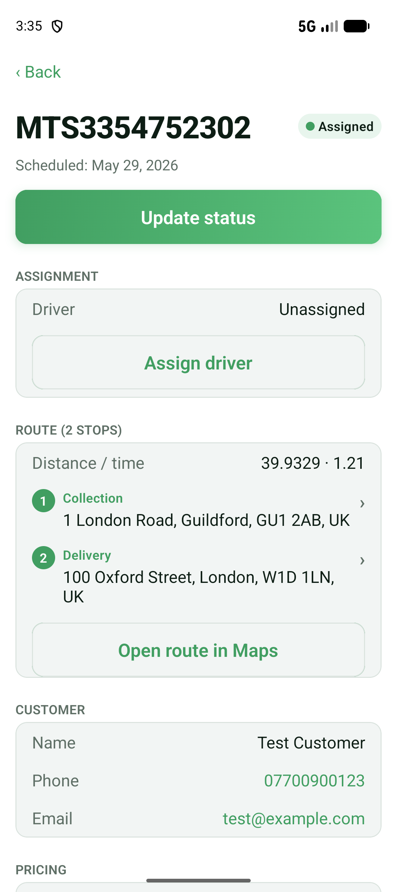

*Scroll down for the full **Pricing** breakdown and **Payment** rows. Each section appears only when
the job carries that data.*

### Top
- **‹ Back** link.
- **Job reference** and **status badge**.
- **Failed-action banner** (red) — if a change to this job was rejected: shows the reason with
  **Retry** and **Discard** actions.
- **Description** and **Scheduled** time, when present.

### Update status
- **Update status** button → opens the **status picker** (a slide-up list of your site's statuses,
  with your current one ticked). Choosing one asks you to **confirm** before it's saved.

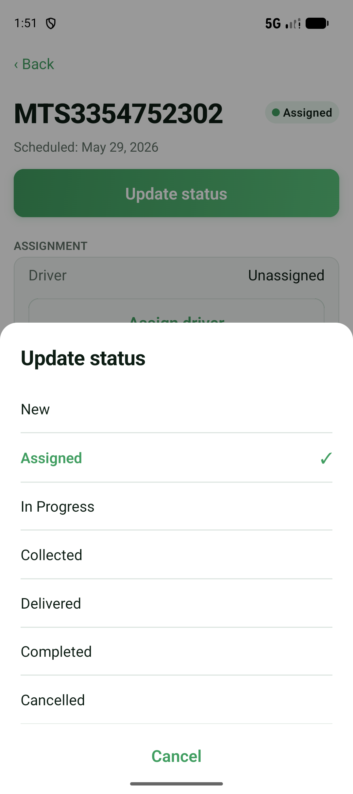

### Assignment *(dispatchers, and decentralized drivers)*
- **Driver** — the assigned driver, or "Unassigned".
- **Claim job** *(decentralized driver, job currently unassigned)* — assigns the job to yourself.
- **Assign driver** *(dispatcher, or a driver permitted to assign)* — opens the **driver picker**;
  choosing a driver asks you to **confirm**.

### Route *(when the job has stops)*
- **Distance / time** summary, when available.
- **Stop list** — each stop; tap a stop to open it in Maps.
- **Open route in Maps** — opens the whole route in your phone's Google Maps.

### Customer *(when present)*
- **Name**.
- **Phone** — tap to call.
- **Email** — tap to email.
- **Reference** — the customer's own reference, when present.

### Pricing *(when present)*
Basic, Distance, Time, Surcharge, Tax (labelled with your site's tax name, e.g. VAT), and **Total**
(emphasised), each in your site's currency. **Weight** is shown when recorded.

### Payment *(when present)*
A list of payment detail rows (label/value pairs) provided by the server.

---

## Drivers *(dispatcher only)*

### Drivers list
Reached from the **Drivers** header link. Each **Driver Card** shows the driver's name, an
availability indicator, and how many jobs are currently assigned to them. Tap a card for detail.
Non-dispatchers who reach this screen are redirected back to Jobs.

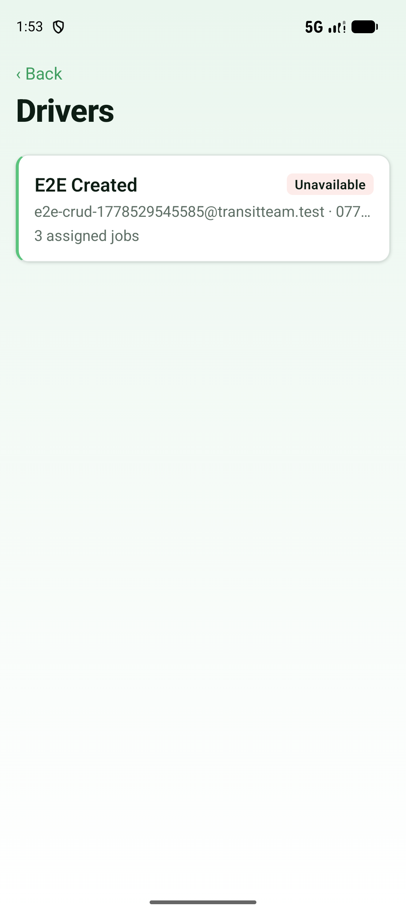

### Driver detail
- Driver **name** and an **Available / Unavailable** badge.
- **Phone** (tap to call) and **Email** (tap to email).
- **Can assign to** — the driver this driver is allowed to assign work to, when applicable.
- **Assigned jobs (N)** — the driver's current jobs as cards; tap one to open it.

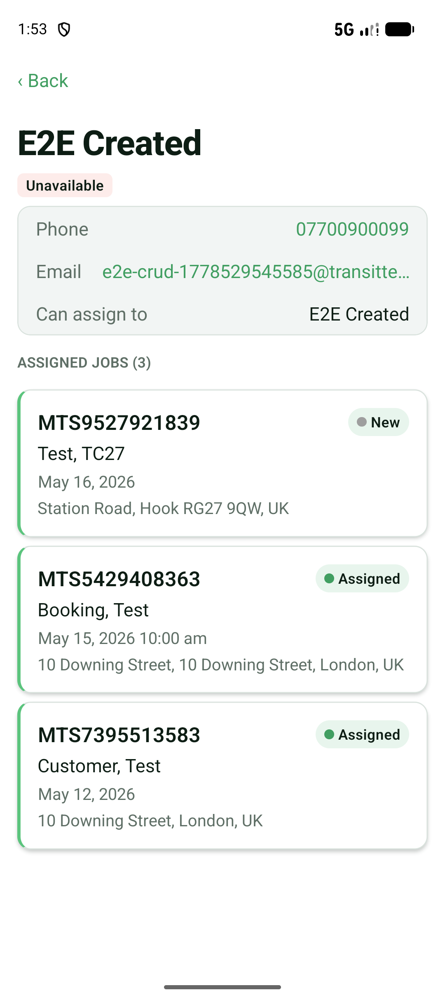

---

## Customers *(dispatcher only)*

### Customers list
Reached from the **Customers** header link.
- **Search** box — filter by name, email, or phone.
- A list of **Customer Cards**; tap for detail. **Pull down** to refresh.
- Empty states: "No customers" or "No matches" when a search returns nothing.

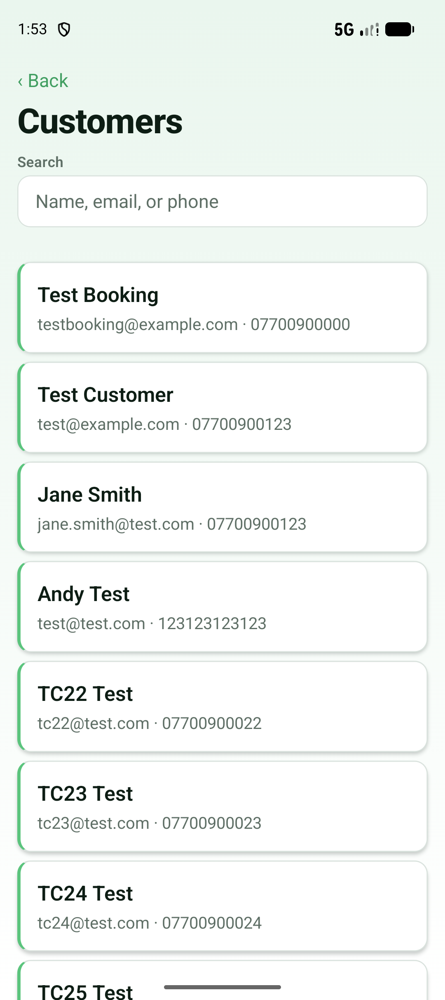

### Customer detail
- Customer **name**.
- **Phone** (tap to call) and **Email** (tap to email).
- **Job history (N)** — every job for this customer as cards; tap one to open it.

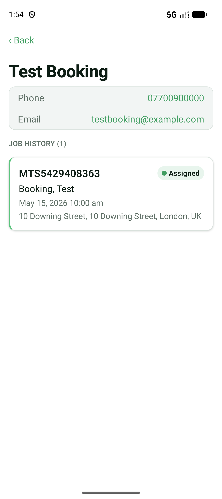

---

## Profile / Settings

Reached from the **Profile** header link.

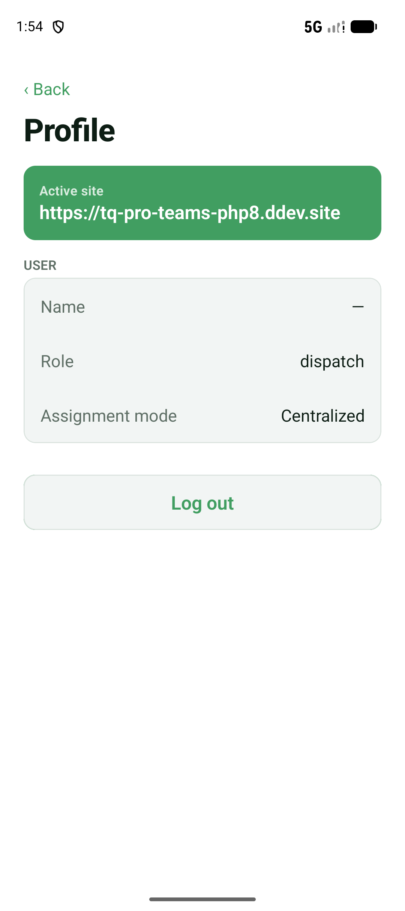

- **‹ Back** link and a **Profile** title.
- **Active site** — the site you're currently using (shown prominently).
- **User** section — your **Name**, **Role**, and **Assignment mode**.
- **Driver** section *(if your account is a driver)* — your **Phone**, **Email**, and
  **Availability**.
- **Switch site** section *(only if more than one site is saved)* — tap a site to switch; the
  active one is ticked.
- **Log out** — signs you out of the current site (with a confirm prompt).

---

**Next:** [06 — Sync & Offline](06-sync-and-offline.md) · [07 — How-To Tasks](07-how-to-tasks.md)
